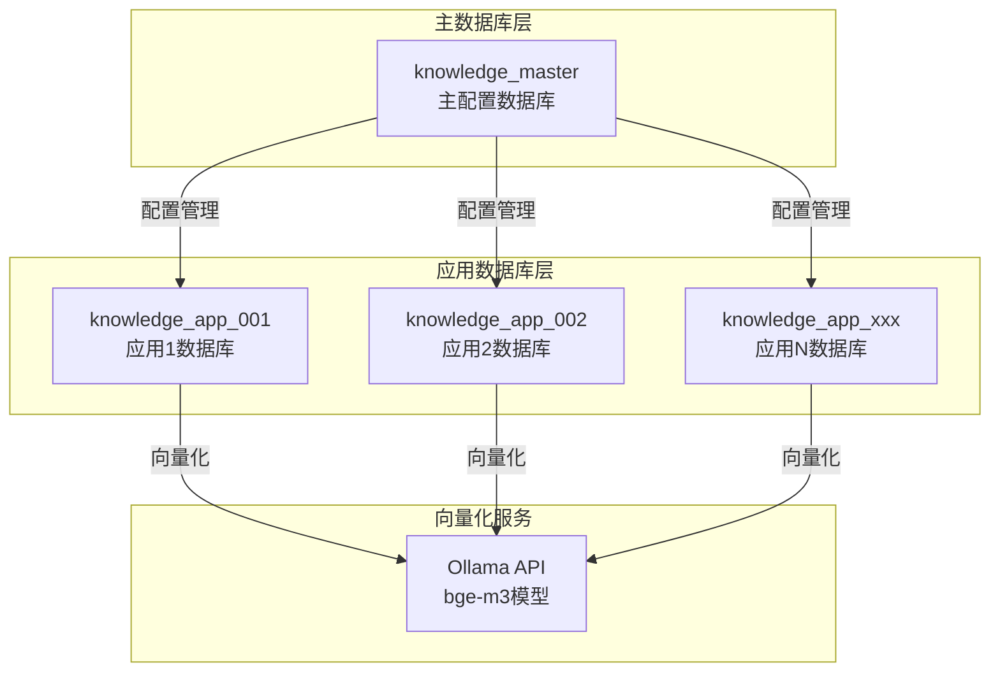
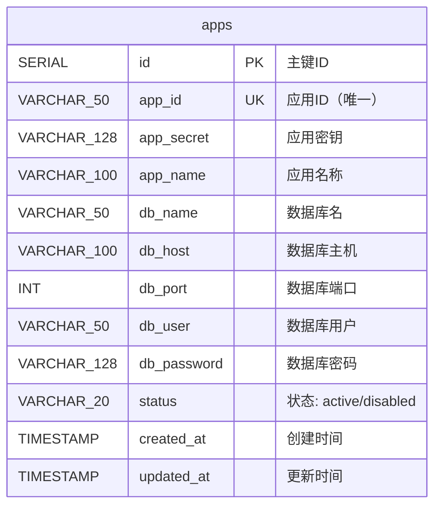
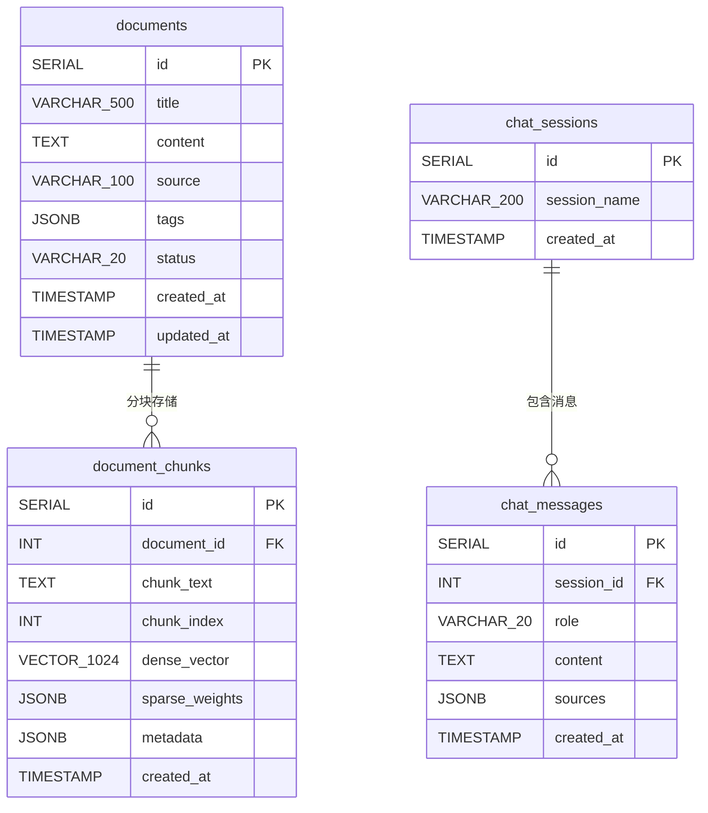
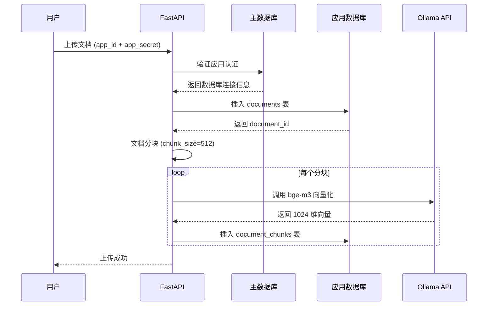
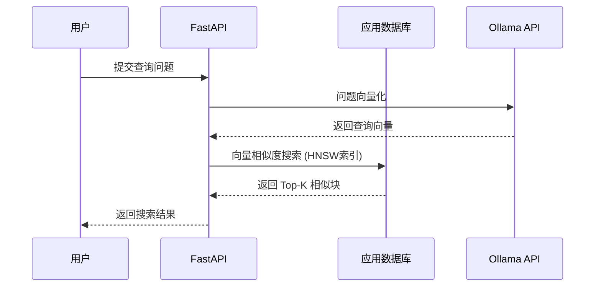
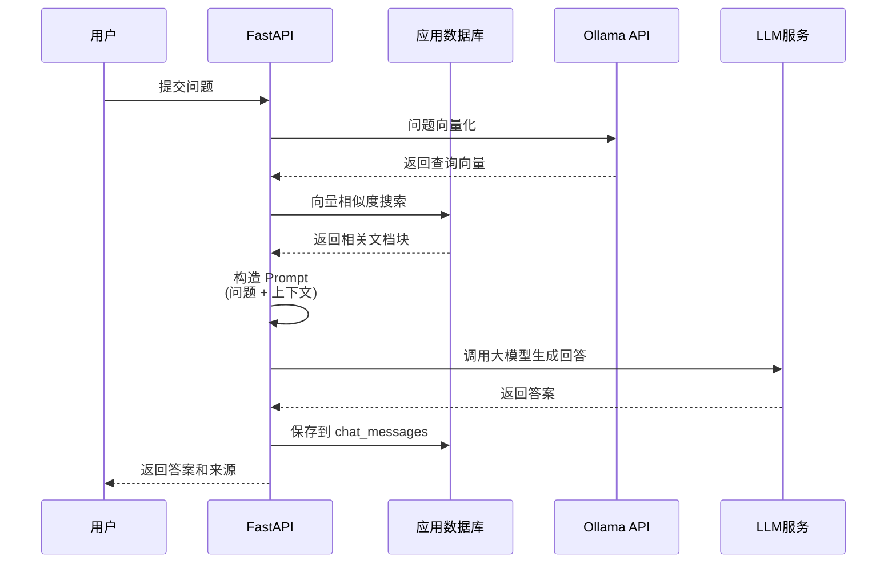

# Knowledge-RAG 数据库设计文档

## 📊 数据库架构概览

Knowledge-RAG 采用**多租户物理隔离**架构，包含以下数据库：

- **主数据库 (knowledge_master)**: 存储所有应用配置和元数据
- **应用数据库 (knowledge_app_xxx)**: 每个应用独立的数据库，存储文档、向量和对话数据



---

## 🗄️ 主数据库 (knowledge_master)

### 表: apps (应用配置表)

存储所有应用的配置信息，包括数据库连接信息和认证密钥。



**字段说明：**

| 字段 | 类型 | 说明 | 默认值 |
|------|------|------|--------|
| id | SERIAL | 主键ID | 自增 |
| app_id | VARCHAR(50) | 应用ID（唯一标识） | - |
| app_secret | VARCHAR(128) | 应用密钥（用于API认证） | - |
| app_name | VARCHAR(100) | 应用名称 | - |
| db_name | VARCHAR(50) | 对应的独立数据库名 | - |
| db_host | VARCHAR(100) | 数据库主机地址 | localhost |
| db_port | INT | 数据库端口 | 5432 |
| db_user | VARCHAR(50) | 数据库用户名 | - |
| db_password | VARCHAR(128) | 数据库密码 | - |
| status | VARCHAR(20) | 应用状态 | active |
| created_at | TIMESTAMP | 创建时间 | NOW() |
| updated_at | TIMESTAMP | 更新时间 | NOW() |

**索引：**
- `idx_apps_app_id`: app_id 字段索引（用于快速查询）
- `idx_apps_status`: status 字段索引（用于过滤活跃应用）

**示例数据：**
```sql
app_id: 'app_001'
app_secret: 'test_secret_001'
app_name: '测试应用1'
db_name: 'knowledge_app_001'
```

---

## 📚 应用数据库 (knowledge_app_xxx)

每个应用拥有独立的数据库，实现物理隔离。

### 数据库扩展

```sql
CREATE EXTENSION IF NOT EXISTS vector;     -- pgvector 向量扩展
CREATE EXTENSION IF NOT EXISTS pg_trgm;    -- 全文检索扩展
```

### ER 图



---

### 表 1: documents (文档表)

存储原始文档内容和元数据。

**字段说明：**

| 字段 | 类型 | 说明 | 默认值 |
|------|------|------|--------|
| id | SERIAL | 主键ID | 自增 |
| title | VARCHAR(500) | 文档标题 | - |
| content | TEXT | 文档完整内容 | - |
| source | VARCHAR(100) | 来源（file/url/text） | - |
| tags | JSONB | 标签数组（JSON格式） | - |
| status | VARCHAR(20) | 状态（active/deleted） | active |
| created_at | TIMESTAMP | 创建时间 | NOW() |
| updated_at | TIMESTAMP | 更新时间 | NOW() |

**索引：**
- `idx_documents_status`: status 字段索引
- `idx_documents_created`: created_at 降序索引

**示例数据：**
```json
{
  "id": 1,
  "title": "如何使用RAG系统",
  "content": "RAG（Retrieval-Augmented Generation）是...",
  "source": "file",
  "tags": ["RAG", "AI", "教程"],
  "status": "active"
}
```

---

### 表 2: document_chunks (文档向量表)

存储文档分块后的向量数据，使用 **pgvector** 扩展。

**字段说明：**

| 字段 | 类型 | 说明 | 默认值 |
|------|------|------|--------|
| id | SERIAL | 主键ID | 自增 |
| document_id | INT | 关联文档ID（外键） | - |
| chunk_text | TEXT | 分块文本内容 | - |
| chunk_index | INT | 分块索引（顺序） | - |
| dense_vector | VECTOR(1024) | 1024维密集向量 | - |
| sparse_weights | JSONB | 稀疏向量权重（可选） | - |
| metadata | JSONB | 元数据（位置、长度等） | - |
| created_at | TIMESTAMP | 创建时间 | NOW() |

**索引：**
- `idx_chunks_vector_hnsw`: HNSW 向量索引（支持高效相似度搜索）

**外键约束：**
- `document_id REFERENCES documents(id) ON DELETE CASCADE`

**向量搜索示例：**
```sql
-- 查找最相似的5个文档块
SELECT chunk_text, 1 - (dense_vector <=> query_vector) as similarity
FROM document_chunks
ORDER BY dense_vector <=> query_vector
LIMIT 5;
```

---

### 表 3: chat_sessions (对话会话表)

存储对话会话信息。

**字段说明：**

| 字段 | 类型 | 说明 | 默认值 |
|------|------|------|--------|
| id | SERIAL | 主键ID | 自增 |
| session_name | VARCHAR(200) | 会话名称 | - |
| created_at | TIMESTAMP | 创建时间 | NOW() |

---

### 表 4: chat_messages (对话消息表)

存储会话中的消息记录。

**字段说明：**

| 字段 | 类型 | 说明 | 默认值 |
|------|------|------|--------|
| id | SERIAL | 主键ID | 自增 |
| session_id | INT | 关联会话ID（外键） | - |
| role | VARCHAR(20) | 角色（user/assistant/system） | - |
| content | TEXT | 消息内容 | - |
| sources | JSONB | 引用来源（文档ID数组） | - |
| created_at | TIMESTAMP | 创建时间 | NOW() |

**外键约束：**
- `session_id REFERENCES chat_sessions(id) ON DELETE CASCADE`

**示例数据：**
```json
{
  "id": 1,
  "session_id": 1,
  "role": "user",
  "content": "什么是RAG？",
  "sources": null
},
{
  "id": 2,
  "session_id": 1,
  "role": "assistant",
  "content": "RAG是检索增强生成技术...",
  "sources": [{"document_id": 1, "chunk_id": 5}]
}
```

---

## 🔄 数据流程图

### 文档上传流程



### 语义搜索流程



### RAG 问答流程



---

## 🔑 核心技术点

### 1. 多租户物理隔离

- **主数据库**: 统一管理应用配置
- **应用数据库**: 每个应用独立数据库，数据完全隔离
- **优势**: 数据安全、易于备份、性能独立

### 2. 向量搜索 (pgvector)

- **向量维度**: 1024 (bge-m3 模型)
- **索引类型**: HNSW (Hierarchical Navigable Small World)
- **距离度量**: 余弦相似度 (cosine similarity)
- **查询性能**: O(log N)

### 3. 文档分块策略

- **分块大小**: 512 字符 (chunk_size)
- **重叠区域**: 可配置
- **向量化**: 使用 Ollama API + bge-m3 模型
- **存储**: 每个分块独立存储向量

### 4. 索引优化

| 索引名称 | 表 | 字段 | 类型 | 用途 |
|---------|-----|------|------|------|
| idx_apps_app_id | apps | app_id | B-tree | 应用查询 |
| idx_apps_status | apps | status | B-tree | 状态过滤 |
| idx_documents_status | documents | status | B-tree | 文档过滤 |
| idx_documents_created | documents | created_at DESC | B-tree | 时间排序 |
| idx_chunks_vector_hnsw | document_chunks | dense_vector | HNSW | 向量搜索 |

---

## 📊 数据库容量估算

假设场景：
- 应用数量: 100 个
- 每个应用平均文档数: 1000 篇
- 每篇文档平均大小: 10KB
- 每篇文档平均分块数: 10 个
- 每个向量大小: 1024 * 4 bytes = 4KB

**存储估算：**

| 数据类型 | 数量 | 单位大小 | 总大小 |
|---------|------|---------|--------|
| 主数据库 (apps) | 100 | 1KB | 100 KB |
| 文档内容 | 100,000 | 10KB | ~1 GB |
| 向量数据 | 1,000,000 | 4KB | ~4 GB |
| 索引开销 | - | - | ~2 GB |
| **总计** | - | - | **~7 GB** |

---

## 🚀 性能优化建议

### 1. 数据库层面
- ✅ 使用 HNSW 索引加速向量搜索
- ✅ 为常用查询字段添加索引
- ✅ 定期执行 VACUUM 清理碎片
- ✅ 合理设置连接池大小

### 2. 应用层面
- ✅ 使用连接池管理数据库连接
- ✅ 批量插入向量数据
- ✅ 缓存热点应用配置
- ✅ 异步处理向量化任务

### 3. 向量搜索优化
- 调整 HNSW 参数 (m, ef_construction)
- 使用适当的 top_k 值
- 考虑混合检索策略 (dense + sparse)

---

## 📖 相关文件

- `init_master.sql` - 主数据库初始化脚本
- `init_app.sql` - 应用数据库初始化脚本
- `README.md` - 项目概述文档
- `app/config.py` - 数据库配置
- `app/services/db_service.py` - 数据库服务

---

## 🔧 快速初始化

```bash
# 1. 创建主数据库
psql -h localhost -U postgres -c "CREATE DATABASE knowledge_master;"
psql -h localhost -U postgres -d knowledge_master -f init_master.sql

# 2. 创建应用数据库
psql -h localhost -U postgres -c "CREATE DATABASE knowledge_app_001;"
psql -h localhost -U postgres -d knowledge_app_001 -f init_app.sql

# 3. 验证
psql -h localhost -U postgres -d knowledge_master -c "\dt"
psql -h localhost -U postgres -d knowledge_app_001 -c "\dt"
```

---

*生成时间: 2026-03-14*
*项目: Knowledge-RAG v1.0*
