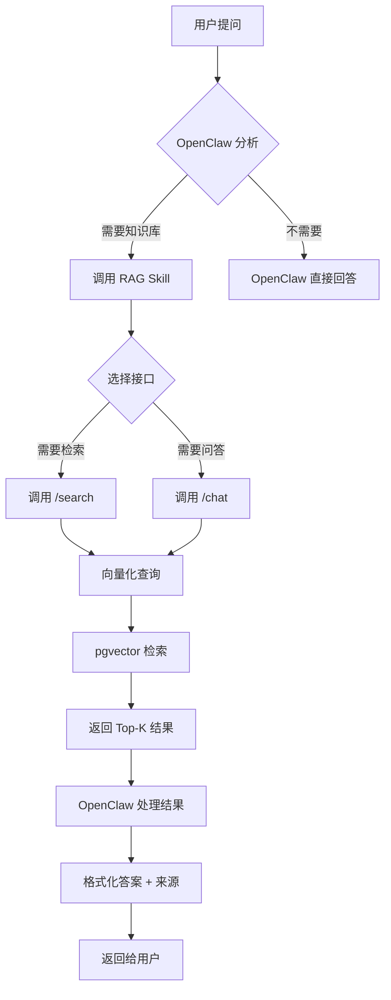

# Knowledge-RAG Skill for OpenClaw

OpenClaw 专用的企业级私有知识库 RAG 检索技能。

## 📋 功能概述

这个 skill 让 OpenClaw 能够：
- 🔍 **语义搜索** - 基于 bge-m3 向量模型进行深度语义理解
- 💬 **智能问答** - RAG 架构，提供有来源的准确答案
- 📚 **引用溯源** - 每个答案都附带参考文档来源
- 🎯 **高准确度** - Recall@5: 95%, MRR: 0.956

## 🚀 快速开始

### 1. 启动 Knowledge-RAG 服务

```bash
cd /path/to/knowledge-rag
./start.sh
```

确保服务运行在 `http://localhost:8000`

### 2. 配置 Skill

复制配置文件并修改：

```bash
cp config.example.json config.json
vim config.json
```

修改认证信息：

```json
{
  "auth": {
    "app_id": "your_app_id",
    "app_secret": "your_app_secret"
  }
}
```

### 3. OpenClaw 集成

在 OpenClaw 配置中添加此 skill：

```yaml
skills:
  - name: knowledge-rag
    path: /path/to/openclaw-skill
    enabled: true
    priority: high
```

## 🎯 使用场景

### 场景 1：专业知识查询

**用户输入：**
```
字节跳动是谁创立的？有什么产品？
```

**OpenClaw 判断：** 需要准确的企业信息 → 调用 RAG skill

**API 调用：**
```bash
POST /api/v1/knowledge/search
{
  "app_id": "app_001",
  "app_secret": "test_secret_001",
  "data": {
    "query": "字节跳动是谁创立的？有什么产品？",
    "top_k": 3
  }
}
```

**OpenClaw 响应：**
```
根据知识库检索结果：

字节跳动由张一鸣于2012年创立。主要产品包括抖音、今日头条等...

📚 参考来源：
1. 《字节跳动创业故事》- 相似度: 98.2%
2. 《互联网独角兽公司分析》- 相似度: 85.3%
```

### 场景 2：多轮对话问答

**用户输入：**
```
创业初期最重要的是什么？
```

**API 调用：**
```bash
POST /api/v1/knowledge/chat
{
  "app_id": "app_001",
  "app_secret": "test_secret_001",
  "data": {
    "query": "创业初期最重要的是什么？",
    "top_k": 3
  }
}
```

**用户追问：**
```
那融资方面呢？
```

**OpenClaw 自动带上 session_id 形成多轮对话**

## 📡 API 接口说明

### 1. 语义搜索接口

**用途：** 当需要检索相关文档片段时使用

**端点：** `POST /api/v1/knowledge/search`

**请求示例：**
```json
{
  "app_id": "app_001",
  "app_secret": "test_secret_001",
  "data": {
    "query": "用户的问题",
    "top_k": 5
  }
}
```

**响应示例：**
```json
{
  "success": true,
  "data": {
    "query": "用户的问题",
    "total": 2,
    "results": [
      {
        "chunk_text": "相关文档内容...",
        "document_id": 2,
        "document_title": "文档标题",
        "similarity_score": 0.9823,
        "chunk_index": 0
      }
    ]
  }
}
```

### 2. RAG 问答接口

**用途：** 当需要生成完整答案时使用

**端点：** `POST /api/v1/knowledge/chat`

**请求示例：**
```json
{
  "app_id": "app_001",
  "app_secret": "test_secret_001",
  "data": {
    "query": "用户的问题",
    "top_k": 3,
    "session_id": 123
  }
}
```

**响应示例：**
```json
{
  "success": true,
  "data": {
    "answer": "根据检索到的资料...",
    "sources": [
      {
        "chunk_text": "参考内容...",
        "document_id": 2,
        "document_title": "文档标题",
        "similarity_score": 0.9823
      }
    ]
  }
}
```

## 🔄 工作流程



## ⚙️ 配置说明

### config.json 完整说明

```json
{
  // 技能基本信息
  "skill_name": "knowledge-rag",
  "skill_version": "1.0.0",
  "enabled": true,

  // API 配置
  "api_config": {
    "base_url": "http://localhost:8000",  // RAG 服务地址
    "timeout": 30,                         // 请求超时时间(秒)
    "retry": 3                             // 失败重试次数
  },

  // 认证配置
  "auth": {
    "app_id": "app_001",                   // 应用ID
    "app_secret": "test_secret_001"        // 应用密钥
  },

  // 搜索配置
  "search_config": {
    "default_top_k": 5,                    // 默认返回数量
    "min_similarity_score": 0.7,           // 最低相似度阈值
    "enable_deduplication": true           // 启用去重
  },

  // 问答配置
  "chat_config": {
    "default_top_k": 3,                    // 问答参考文档数
    "enable_session": true,                // 启用会话管理
    "max_context_length": 2000             // 最大上下文长度
  },

  // 触发关键词（可选）
  "trigger_keywords": [
    "根据知识库",
    "查询文档"
  ],

  // 响应模板
  "response_template": {
    "with_sources": "根据知识库：\n{answer}\n\n📚 来源：\n{sources}",
    "no_results": "知识库中未找到相关内容。",
    "error": "知识库服务暂时不可用。"
  }
}
```

## 🎨 OpenClaw 集成示例

### Python 伪代码

```python
import requests
import json

class KnowledgeRAGSkill:
    def __init__(self, config_path):
        with open(config_path) as f:
            self.config = json.load(f)

    def should_trigger(self, user_input):
        """判断是否需要调用 RAG"""
        keywords = self.config.get('trigger_keywords', [])
        # 检查是否包含触发关键词
        for keyword in keywords:
            if keyword in user_input:
                return True

        # 或使用 OpenClaw 的意图识别
        # 判断问题是否需要专业知识
        return self.is_professional_question(user_input)

    def search(self, query, top_k=None):
        """语义搜索"""
        if top_k is None:
            top_k = self.config['search_config']['default_top_k']

        url = f"{self.config['api_config']['base_url']}/api/v1/knowledge/search"
        payload = {
            "app_id": self.config['auth']['app_id'],
            "app_secret": self.config['auth']['app_secret'],
            "data": {
                "query": query,
                "top_k": top_k
            }
        }

        response = requests.post(url, json=payload,
                                timeout=self.config['api_config']['timeout'])
        return response.json()

    def chat(self, query, session_id=None, top_k=None):
        """RAG 问答"""
        if top_k is None:
            top_k = self.config['chat_config']['default_top_k']

        url = f"{self.config['api_config']['base_url']}/api/v1/knowledge/chat"
        payload = {
            "app_id": self.config['auth']['app_id'],
            "app_secret": self.config['auth']['app_secret'],
            "data": {
                "query": query,
                "top_k": top_k
            }
        }

        if session_id:
            payload['data']['session_id'] = session_id

        response = requests.post(url, json=payload,
                                timeout=self.config['api_config']['timeout'])
        return response.json()

    def format_response(self, result):
        """格式化响应"""
        if not result.get('success'):
            return self.config['response_template']['error']

        data = result.get('data', {})

        # 如果是搜索结果
        if 'results' in data:
            results = data['results']
            if not results:
                return self.config['response_template']['no_results']

            # 过滤低相似度结果
            min_score = self.config['search_config']['min_similarity_score']
            filtered = [r for r in results if r['similarity_score'] >= min_score]

            if not filtered:
                return self.config['response_template']['no_results']

            # 格式化来源
            sources = []
            for idx, r in enumerate(filtered, 1):
                sources.append(
                    f"{idx}. 《{r['document_title']}》- 相似度: {r['similarity_score']*100:.1f}%"
                )

            return {
                'results': filtered,
                'formatted_sources': '\n'.join(sources)
            }

        # 如果是问答结果
        if 'answer' in data:
            answer = data['answer']
            sources = data.get('sources', [])

            sources_text = []
            for idx, s in enumerate(sources, 1):
                sources_text.append(
                    f"{idx}. 《{s['document_title']}》- 相似度: {s['similarity_score']*100:.1f}%"
                )

            template = self.config['response_template']['with_sources']
            return template.format(
                answer=answer,
                sources='\n'.join(sources_text)
            )

# 使用示例
skill = KnowledgeRAGSkill('config.json')

user_input = "字节跳动是谁创立的？"

if skill.should_trigger(user_input):
    # 方式1：使用搜索，OpenClaw 自己生成答案
    result = skill.search(user_input)
    formatted = skill.format_response(result)

    # OpenClaw 基于检索结果生成答案
    answer = openclaw.generate_answer(user_input, context=formatted['results'])
    print(f"{answer}\n\n{formatted['formatted_sources']}")

    # 方式2：直接使用 RAG 问答
    result = skill.chat(user_input)
    print(skill.format_response(result))
```

## 📊 性能指标

| 指标 | 数值 | 说明 |
|------|------|------|
| **Recall@5** | 95.0% | 前5个结果包含相关内容的概率 |
| **MRR** | 0.956 | 平均倒数排名，衡量首个相关结果位置 |
| **NDCG@5** | 0.986 | 归一化折损累积增益 |
| **P50响应** | 214ms | 中位数响应时间 |
| **P95响应** | 298ms | 95分位响应时间 |

## 🔧 故障排除

### 问题1: 连接失败

```
错误: Connection refused to localhost:8000
```

**解决方案：**
```bash
# 检查 RAG 服务是否运行
curl http://localhost:8000/health

# 启动服务
cd knowledge-rag && ./start.sh
```

### 问题2: 认证失败

```
错误: 401 Unauthorized
```

**解决方案：**
- 检查 `config.json` 中的 `app_id` 和 `app_secret` 是否正确
- 确认应用在数据库中是否存在且状态为 `active`

### 问题3: 无搜索结果

**可能原因：**
- 知识库中没有相关文档
- 相似度阈值设置过高

**解决方案：**
- 降低 `min_similarity_score` 阈值（默认 0.7）
- 检查知识库中是否有相关文档：
  ```bash
  curl -X POST "http://localhost:8000/api/v1/document/list" \
    -H "Content-Type: application/json" \
    -d '{"app_id":"app_001","app_secret":"test_secret_001","data":{}}'
  ```

## 📚 相关文档

- [Knowledge-RAG 项目文档](../README.md)
- [API 完整文档](../API文档.md)
- [数据库设计](../DATABASE.md)
- [快速开始指南](../GETTING_STARTED.md)

## 🔗 技术架构

```
OpenClaw
    ↓
Knowledge-RAG Skill (此项目)
    ↓
Knowledge-RAG API (FastAPI)
    ↓
┌─────────────┬──────────────┐
│             │              │
Ollama API    PostgreSQL    LLM服务(可选)
(bge-m3)      (pgvector)
```

## 📝 许可证

MIT License

---

**最后更新: 2026-03-14**
