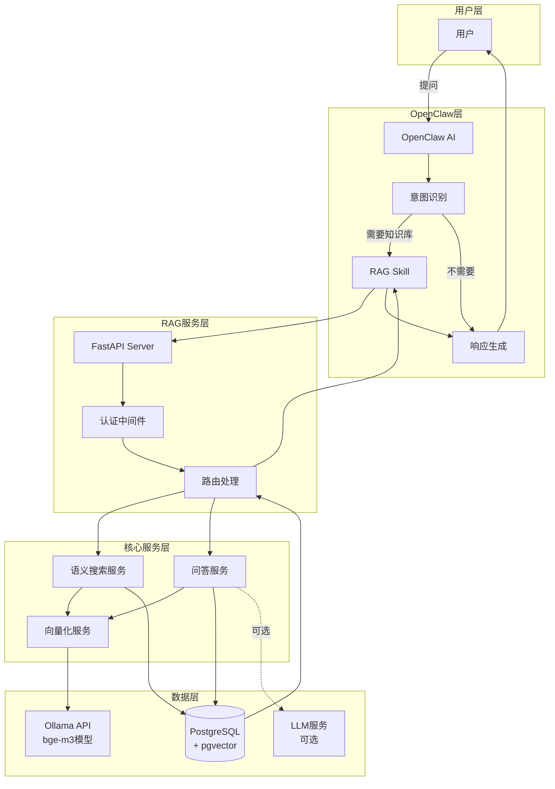
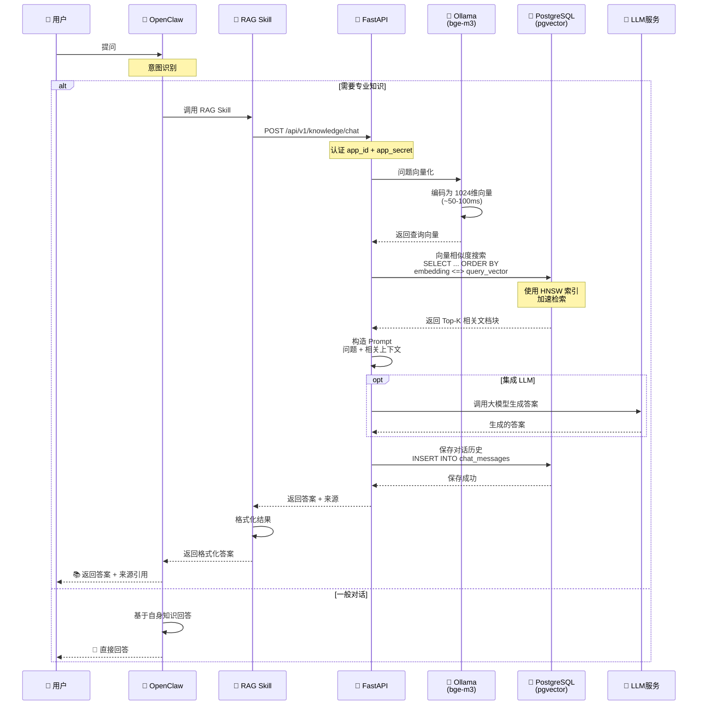
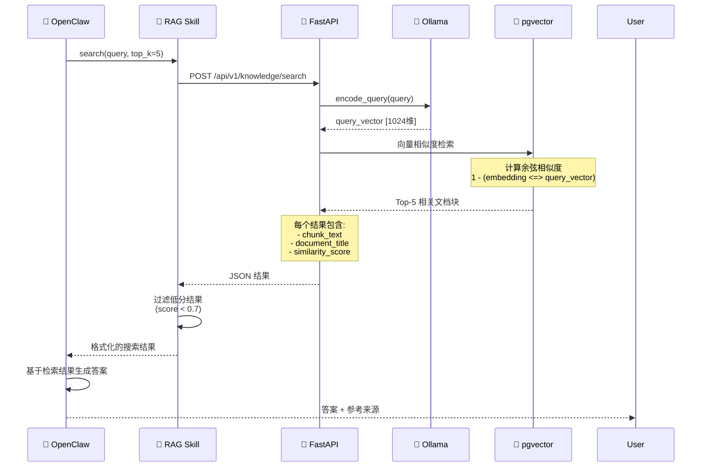
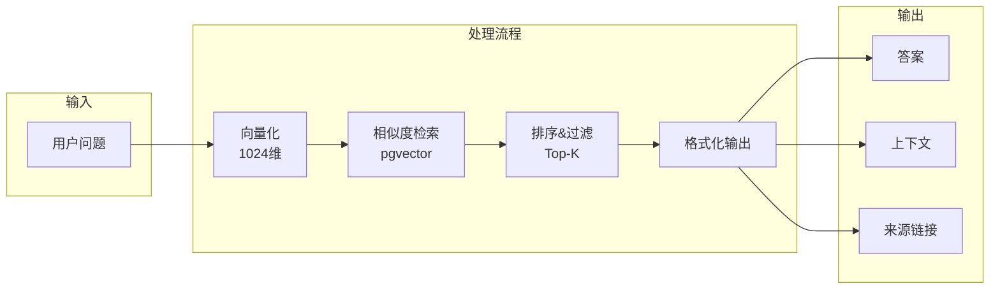
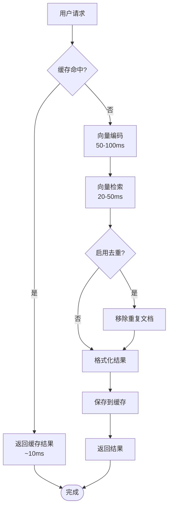
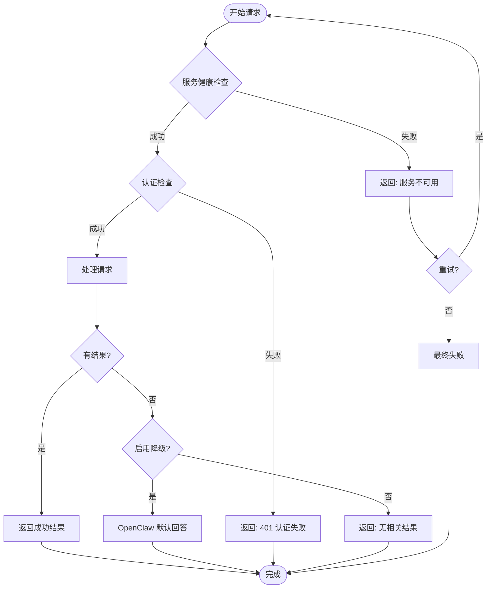
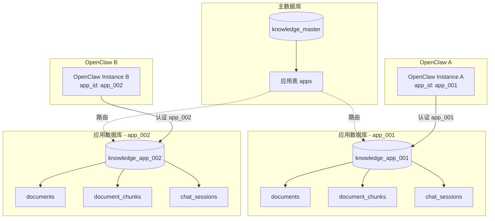
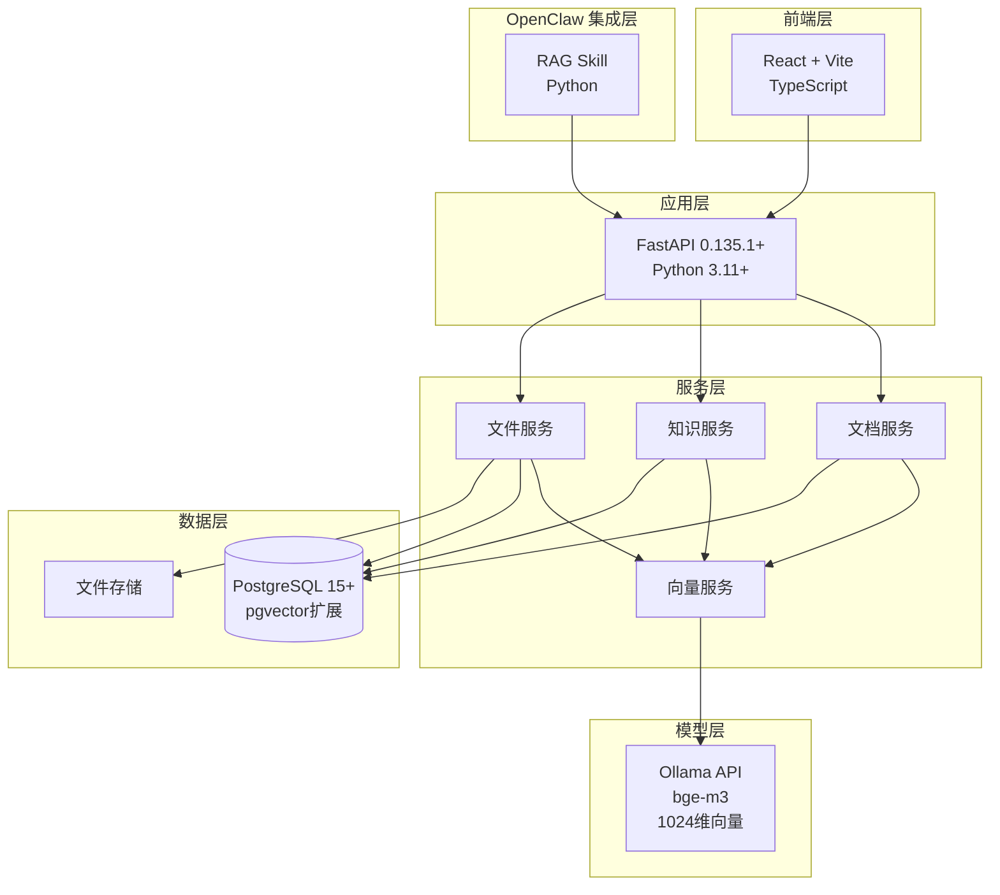

# Knowledge-RAG 工作流程图

## 整体架构



## RAG 问答详细流程



## 语义搜索流程



## 决策树：何时使用 RAG

```mermaid
graph TD
    Start([用户提问]) --> Q1{包含触发关键词?}

    Q1 -->|是| UseRAG[使用 RAG]
    Q1 -->|否| Q2{是专业知识问题?}

    Q2 -->|是| UseRAG
    Q2 -->|否| Q3{需要引用来源?}

    Q3 -->|是| UseRAG
    Q3 -->|否| Q4{知识库有相关内容?}

    Q4 -->|是| UseRAG
    Q4 -->|否| DirectAnswer[OpenClaw 直接回答]

    UseRAG --> ChooseAPI{选择接口}

    ChooseAPI -->|只需检索| SearchAPI[/api/v1/knowledge/search]
    ChooseAPI -->|需要完整答案| ChatAPI[/api/v1/knowledge/chat]

    SearchAPI --> Format1[OpenClaw 生成答案]
    ChatAPI --> Format2[直接返回 RAG 答案]

    Format1 --> End([返回给用户])
    Format2 --> End
    DirectAnswer --> End
```

## 数据流图



## 性能优化流程



## 错误处理流程



## 多租户隔离架构



## 完整技术栈


